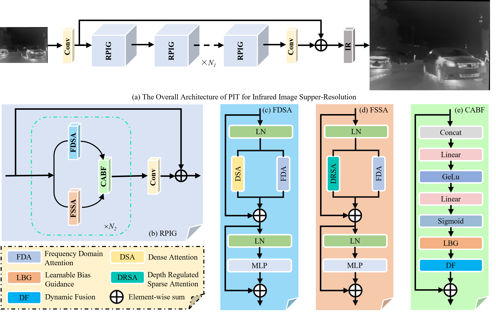
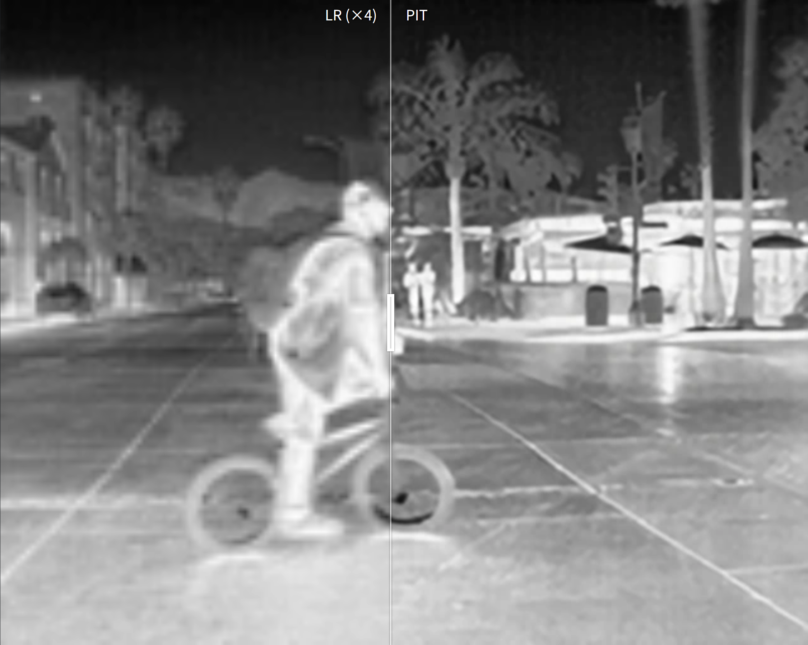
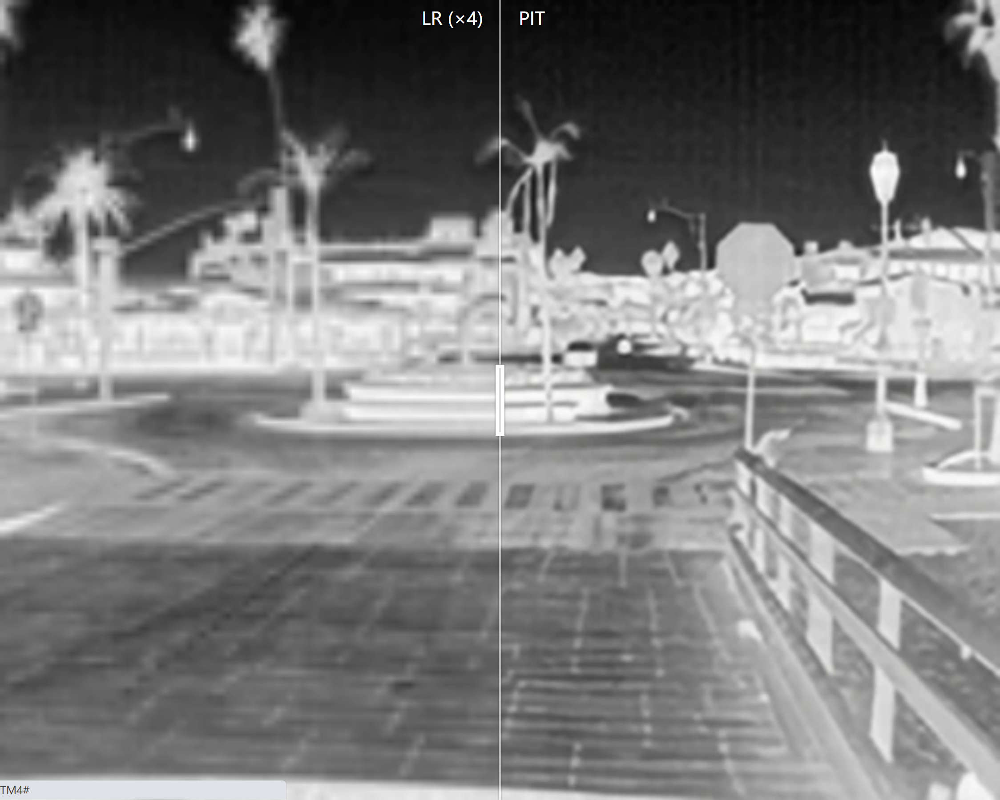
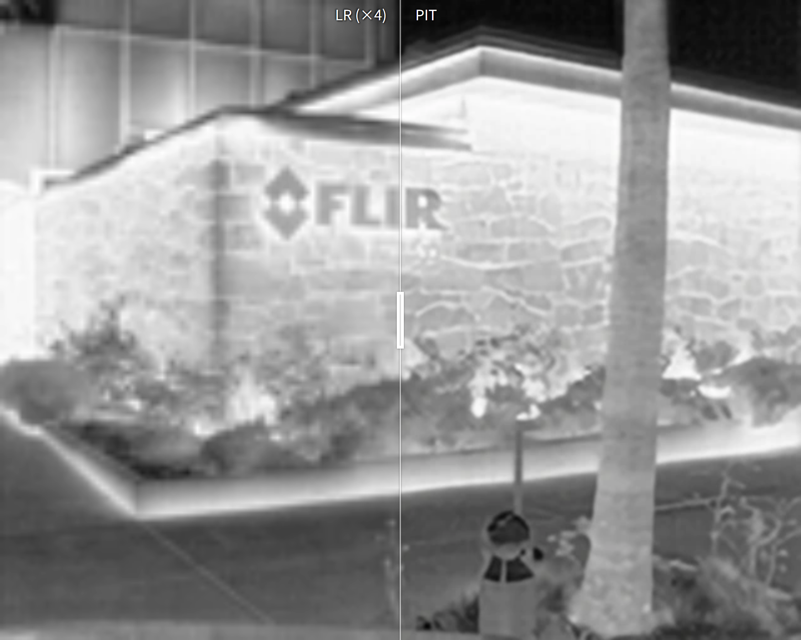
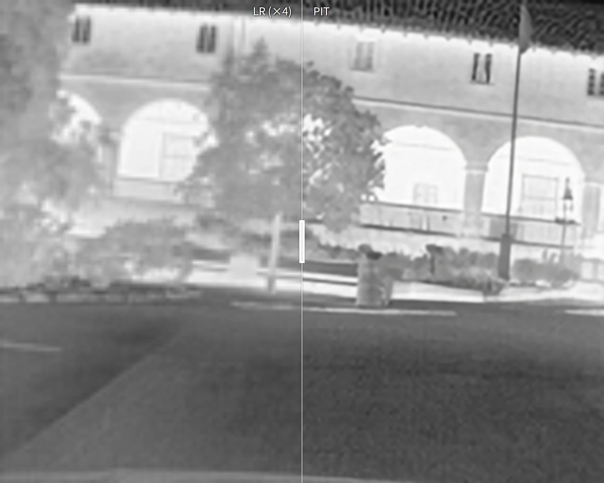

# Spatial-Frequency Collaborative Learning for Infrared Image Super-Resolution


---
This code is the PyTorch implementation of PIT model. Our PIT achieves **state-of-the-art** performance in Infrared Image Super-resolution



>**Abstract:**
>Infrared image super-resolution (IRSR) aims at improving the resolution of infrared images while recovering the structure and texture details. To enhance the performance of IRSR, both spatial domain information and the frequency domain information are crutial. In this paper, we explore a spatial-frequency collaborative learning strategy to comprehensively utilize the spatial and frequency information for IRSR. Specifically, we propose a frequency domain attention (FDA) module integrated in parallel with dense and sparse attention to enable collaborative modeling across spatial and frequency domains, thereby enhancing the frequency representation capability of the network. Moreover, to effectively capture hierarchical information, we propose a Parallel Interactive Transformer (PIT) method by applying dense and sparse modeling to shallow features separately, and we propose a content-aware branch fusion (CABF) module to adaptively integrate their complementary advantages. Extensive experiments demonstrate that PIT outperforms existing state-of-the-art methods on multiple public infrared image datasets. 


##More results

[](https://imgsli.com/NDE2NTQz)
[](https://imgsli.com/NDE2NTM4)
[](https://imgsli.com/NDE2NTM5)
[](https://imgsli.com/NDE2NTQx)


##Requirements

-python 3.8
-pyTorch >= 1.8.0
-NVIDIA GPU +[CUDA](https://developer.nvidia.com/cuda-downloads)

##Installation
```bash
git clone https://github.com/WYpetuous/PIT.git
cd PIT
pip install -r requirements.txt
python setup.py develop
```


##Datasets

Used training and testing sets can be downloaded as follows: [M3FD_TNO_RoadScene](https://drive.google.com/drive/folders/1K8pRnyiwW6dJ0Kfr_yDVEI57qbXwoUjQ?usp=drive_link).


Download  training and testing datasets and put them into the folder`datasets/`. Go to the folder to find details of directory structure.

##Training
1.Please download the corresponding training datasets and put them in the folder`datasets`. Download the testing datasets and put them in the folder`datasets`.
2.Follow the instructions below to begin training our PIT model.
```bash

python basicsr/train.py -opt options/train/train_PIT_SR_x2.yml
python basicsr/train.py -opt options/train/train_PIT_SR_x4.yml
```
Run the script then you can find the generated experimental logs in the folder`experiments`.


##Testing
1.Please download the corresponding testing datasets and put them in the folder`datasets`. Download the corresponding models and put them in the folder`experiments`.
2.Follow the instructions below to begin testing our PIT model.
```bash

python basicsr/test.py -opt options/test/test_PIT_SR_x2.yml
python basicsr/test.py -opt options/test/test_PIT_SR_x4.yml
```

##Citation

If you find the code helpful in your resarch or work, please cite the following paper(s).
```
@inproceedings{
}
```

##Acknowledgement

The codes are based on [BasicSR](https://github.com/xinntao/BasicSR)and [ART](https://github.com/gladzhang/ART). Thanks for their awesome works.
